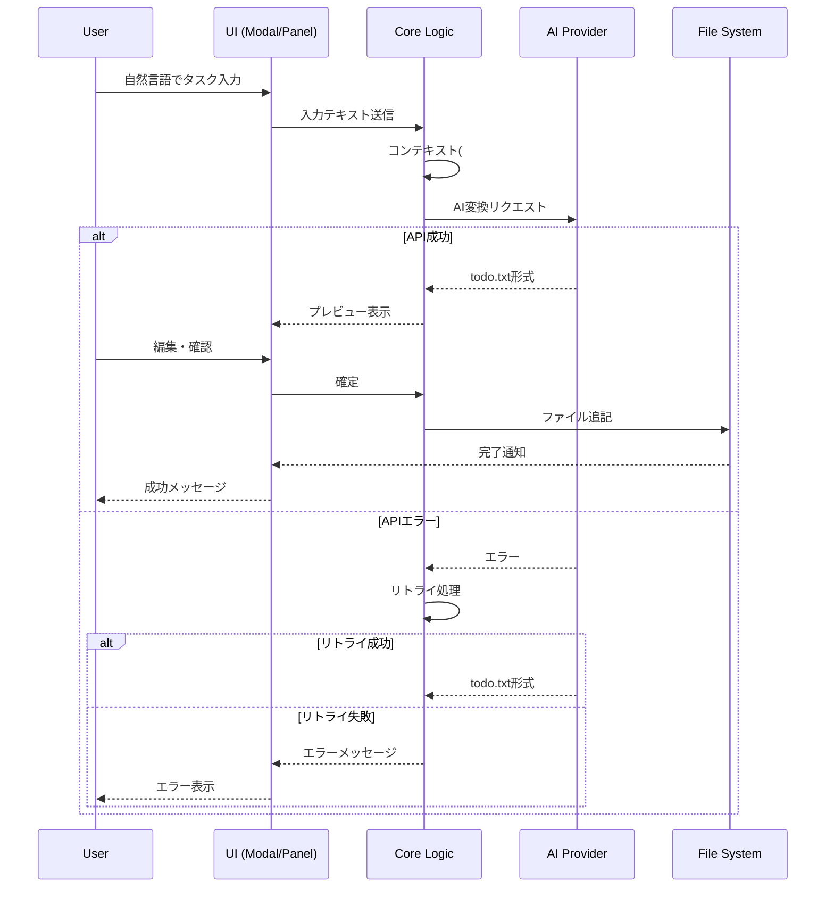

# todonoeai - Obsidian Plugin 仕様書

## 1. 概要

### 1.1 プラグイン名
**todonoeai**（todo + の + AI = todoのAI）

### 1.2 目的
ユーザーが自然言語でタスクを入力すると、生成AIがtodo.txt形式に変換し、指定されたファイルに追記するObsidianプラグイン。

### 1.3 主な機能
- 自然言語からtodo.txt形式への自動変換
- 複数のAIプロバイダー対応（OpenAI、Anthropic、Gemini、OpenRouter）
- プロジェクト・コンテキスト・期限の自動抽出
- 編集可能なプレビュー機能
- 複数タスクの一括入力対応

---

## 2. 機能仕様

### 2.1 入力インターフェース

#### 2.1.1 起動方法
| 方法 | 説明 |
|------|------|
| コマンドパレット | `Ctrl/Cmd + P` → "todonoeai: Add Todo" |
| リボンアイコン | 左サイドバーにアイコンを配置 |
| サイドバーパネル | 右サイドバーに常駐するView（パネル形式） |

#### 2.1.2 入力形式
- テキストエリアに自然言語でタスクを入力
- 複数タスクは改行または箇条書き（`-`、`*`、`・`）で区切り
- ハッシュタグでコンテキストを指定

**入力例：**
```
プロジェクトAの件
田中さんにメールを送る #pc
来週金曜日までに資料を作成
会議室を予約する #phone
```

### 2.2 todo.txt形式への変換

#### 2.2.1 変換ルール

| 要素 | 入力形式 | 出力形式 | 備考 |
|------|----------|----------|------|
| 作成日 | （自動付与） | `YYYY-MM-DD` | ユーザー指定がなければ当日 |
| 優先度 | 「重要」「急ぎ」「緊急」等 | `(A)`〜`(Z)` | ユーザー明示時のみ |
| プロジェクト | 「〇〇についてです」「〇〇の件」「〇〇関連」 | `+ProjectName` | 文頭のパターンで判定 |
| コンテキスト | `#keyword` | `@keyword` | 文末のハッシュタグ |
| 期限 | 「来週まで」「金曜日に」等 | `due:YYYY-MM-DD` | 相対日付を絶対日付に変換 |

#### 2.2.2 プロジェクト判定パターン
以下のパターンが文頭にある場合、プロジェクトとして抽出：
- `〇〇についてです。`
- `〇〇の件`
- `〇〇関連`

**変換例：**
```
入力: プロジェクトAの件
      田中さんにメールを送る #pc
      来週金曜日までに資料を作成

出力:
2025-01-13 田中さんにメールを送る +ProjectA @pc
2025-01-13 資料を作成 +ProjectA @pc due:2025-01-17
```

#### 2.2.3 コンテキストのマジックキーワード
文末に `#keyword` 形式で記述することでコンテキストを指定。

**対応例：**
| 入力 | 出力 |
|------|------|
| `#pc` | `@pc` |
| `#phone` | `@phone` |
| `#home` | `@home` |
| `#office` | `@office` |
| `#email` | `@email` |

ユーザーは設定画面でカスタムキーワードを追加可能。

#### 2.2.4 優先度の判定
ユーザーが明示的に指定した場合のみ優先度を付与：

| 入力キーワード | 優先度 |
|----------------|--------|
| 「緊急」「最優先」「すぐに」 | `(A)` |
| 「重要」「優先」 | `(B)` |
| 「急ぎ」 | `(C)` |

#### 2.2.5 期限の自動抽出
自然言語の日付表現を解析し、`due:YYYY-MM-DD` 形式に変換：

| 入力表現 | 変換結果（例：今日が2025-01-13の場合） |
|----------|----------------------------------------|
| 「今日中に」 | `due:2025-01-13` |
| 「明日まで」 | `due:2025-01-14` |
| 「来週まで」 | `due:2025-01-20` |
| 「来週金曜日に」 | `due:2025-01-17` |
| 「1月20日まで」 | `due:2025-01-20` |
| 「月末まで」 | `due:2025-01-31` |

### 2.3 プレビュー・編集機能

#### 2.3.1 フロー
```
[入力] → [AI生成] → [プレビュー表示] → [編集可能] → [確認] → [ファイル追記]
```

#### 2.3.2 プレビュー画面
- 生成されたtodo.txt形式をテキストエリアで表示
- ユーザーは内容を編集可能
- 「追加」ボタンでファイルに追記
- 「キャンセル」ボタンで破棄
- 「再生成」ボタンでAI再実行

### 2.4 サイドバーパネル

#### 2.4.1 構成
```
┌─────────────────────────────────┐
│  todonoeai                      │
├─────────────────────────────────┤
│ ┌─────────────────────────────┐ │
│ │ タスクを入力...              │ │
│ │                             │ │
│ │                             │ │
│ └─────────────────────────────┘ │
│ [生成] [クリア]                  │
├─────────────────────────────────┤
│ プレビュー:                      │
│ ┌─────────────────────────────┐ │
│ │ (生成されたtodo.txt)         │ │
│ │                             │ │
│ └─────────────────────────────┘ │
│ [追加] [再生成] [キャンセル]     │
└─────────────────────────────────┘
```

---

## 3. 設定仕様

### 3.1 設定項目

#### 3.1.1 AIプロバイダー設定

| 設定項目 | 型 | 説明 | デフォルト |
|----------|-----|------|------------|
| Provider | Dropdown | AIプロバイダーの選択 | OpenAI |
| API Key | Password | 選択したプロバイダーのAPIキー | - |
| Model | Dropdown | 使用するモデル | プロバイダーによる |
| Base URL | Text | カスタムエンドポイント（OpenRouter等用） | - |

**対応プロバイダー：**
- OpenAI（GPT-4o、GPT-4o-mini等）
- Anthropic（Claude 3.5 Sonnet、Claude 3 Haiku等）
- Google Gemini（Gemini 1.5 Pro、Gemini 1.5 Flash等）
- OpenRouter（任意のモデル）

#### 3.1.2 出力設定

| 設定項目 | 型 | 説明 | デフォルト |
|----------|-----|------|------------|
| Output File | FilePath | todo.txtの出力先ファイル | `todo.txt` |
| Append Position | Dropdown | 追記位置（先頭/末尾） | 末尾 |
| Include Creation Date | Toggle | 作成日を含めるか | ON |

#### 3.1.3 コンテキスト設定

| 設定項目 | 型 | 説明 | デフォルト |
|----------|-----|------|------------|
| Custom Contexts | KeyValue[] | カスタムキーワード→コンテキストのマッピング | `[]` |

**設定例：**
```json
{
  "customContexts": {
    "パソコン": "pc",
    "スマホ": "phone",
    "買い物": "shopping"
  }
}
```

#### 3.1.4 動作設定

| 設定項目 | 型 | 説明 | デフォルト |
|----------|-----|------|------------|
| Auto Retry | Toggle | APIエラー時の自動リトライ | ON |
| Max Retries | Number | 最大リトライ回数 | 3 |
| Retry Delay | Number | リトライ間隔（ミリ秒） | 1000 |

---

## 4. 技術仕様

### 4.1 アーキテクチャ

```
┌─────────────────────────────────────────────────────────┐
│                    Obsidian Plugin                       │
├─────────────────────────────────────────────────────────┤
│  ┌─────────────┐  ┌─────────────┐  ┌─────────────────┐  │
│  │   UI Layer  │  │  Core Logic │  │  AI Provider    │  │
│  │             │  │             │  │  Abstraction    │  │
│  │  - Modal    │  │  - Parser   │  │                 │  │
│  │  - Panel    │  │  - Formatter│  │  - OpenAI       │  │
│  │  - Settings │  │  - Validator│  │  - Anthropic    │  │
│  │             │  │             │  │  - Gemini       │  │
│  │             │  │             │  │  - OpenRouter   │  │
│  └─────────────┘  └─────────────┘  └─────────────────┘  │
│         │                │                  │           │
│         └────────────────┴──────────────────┘           │
│                          │                              │
│                  ┌───────▼───────┐                      │
│                  │  File System  │                      │
│                  │  (Vault API)  │                      │
│                  └───────────────┘                      │
└─────────────────────────────────────────────────────────┘
```

### 4.2 モジュール構成

```
src/
├── main.ts                 # プラグインエントリーポイント
├── settings.ts             # 設定管理
├── ui/
│   ├── TodoModal.ts        # モーダルダイアログ
│   ├── TodoPanel.ts        # サイドバーパネル（ItemView）
│   └── SettingsTab.ts      # 設定画面
├── core/
│   ├── TodoParser.ts       # 入力解析
│   ├── TodoFormatter.ts    # todo.txt形式への整形
│   └── DateParser.ts       # 日付表現の解析
├── ai/
│   ├── AIProvider.ts       # AIプロバイダーインターフェース
│   ├── OpenAIProvider.ts   # OpenAI実装
│   ├── AnthropicProvider.ts# Anthropic実装
│   ├── GeminiProvider.ts   # Gemini実装
│   └── OpenRouterProvider.ts# OpenRouter実装
└── types/
    └── index.ts            # 型定義
```

### 4.3 AIプロンプト設計

#### 4.3.1 システムプロンプト

```
あなたはタスク管理の専門家です。ユーザーの自然言語入力をtodo.txt形式に変換してください。

## 変換ルール
1. 各タスクは1行で表現
2. 作成日は YYYY-MM-DD 形式で先頭に付与
3. プロジェクトは +ProjectName 形式
4. コンテキストは @context 形式
5. 期限は due:YYYY-MM-DD 形式

## プロジェクト判定
文頭が以下のパターンの場合、後続のタスクにプロジェクトを付与：
- 「〇〇についてです」
- 「〇〇の件」
- 「〇〇関連」

## コンテキスト判定
入力文末の #keyword を @keyword に変換

## 優先度判定
「緊急」「最優先」→ (A)
「重要」「優先」→ (B)
「急ぎ」→ (C)
それ以外は優先度なし

## 期限判定
相対的な日付表現を絶対日付に変換
今日の日付: {current_date}

## 出力形式
todo.txt形式のみを出力（説明不要）
```

### 4.4 エラーハンドリング

#### 4.4.1 リトライ戦略
- 最大3回の自動リトライ
- Exponential backoff（1秒 → 2秒 → 4秒）
- リトライ対象エラー：
  - ネットワークエラー
  - レート制限（429）
  - サーバーエラー（5xx）

#### 4.4.2 エラーメッセージ

| エラー種別 | メッセージ |
|-----------|-----------|
| API Key未設定 | 「APIキーが設定されていません。設定画面でAPIキーを入力してください。」 |
| ネットワークエラー | 「ネットワークエラーが発生しました。接続を確認してください。」 |
| レート制限 | 「API制限に達しました。しばらく待ってから再試行してください。」 |
| 出力ファイル未設定 | 「出力ファイルが設定されていません。設定画面で出力先を指定してください。」 |

---

## 5. データフロー

### 5.1 タスク追加フロー



---

## 6. 使用例

### 6.1 基本的な使い方

**入力：**
```
明日までに報告書を提出する #pc
```

**出力：**
```
2025-01-13 報告書を提出する @pc due:2025-01-14
```

### 6.2 プロジェクト付きタスク

**入力：**
```
新商品開発の件
市場調査を行う
競合分析レポートを作成 #pc
来週金曜日までにプレゼン資料を準備
```

**出力：**
```
2025-01-13 市場調査を行う +新商品開発
2025-01-13 競合分析レポートを作成 +新商品開発 @pc
2025-01-13 プレゼン資料を準備 +新商品開発 due:2025-01-17
```

### 6.3 優先度付きタスク

**入力：**
```
緊急：クライアントに連絡する #phone
重要：契約書を確認する
```

**出力：**
```
(A) 2025-01-13 クライアントに連絡する @phone
(B) 2025-01-13 契約書を確認する
```

---

## 7. 今後の拡張候補（スコープ外）

以下は初期リリースには含めないが、将来的な拡張候補：

1. **既存todo.txt の読み込み・表示機能**
2. **タスク完了機能**（`x` マークの付与）
3. **フィルタリング・検索機能**
4. **定期タスク（繰り返し）対応**
5. **音声入力対応**
6. **他のタスク管理ツールとの連携**

---

## 8. 変更履歴

| バージョン | 日付 | 変更内容 |
|-----------|------|----------|
| 1.0.0 | 2025-01-13 | 初版作成 |
